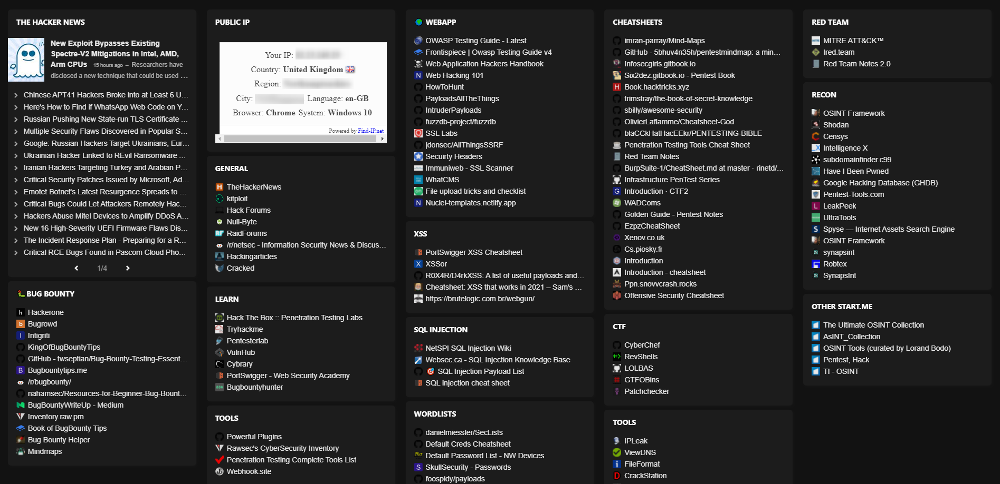

# start-me

So I like Start.me and use it like a quick dashboard i can use to jump to my favorite tools and resources. Nothing ground breaking but i like it 

Here i am sharing my pentest board

## Features
- shows news from TheHackerNews
- Will display your public IP address.

I will try and update it as i go along with cool stuff and trying to keepo it minimal and less spammy.  

https://start.me/p/Bnrx8w/pentest

